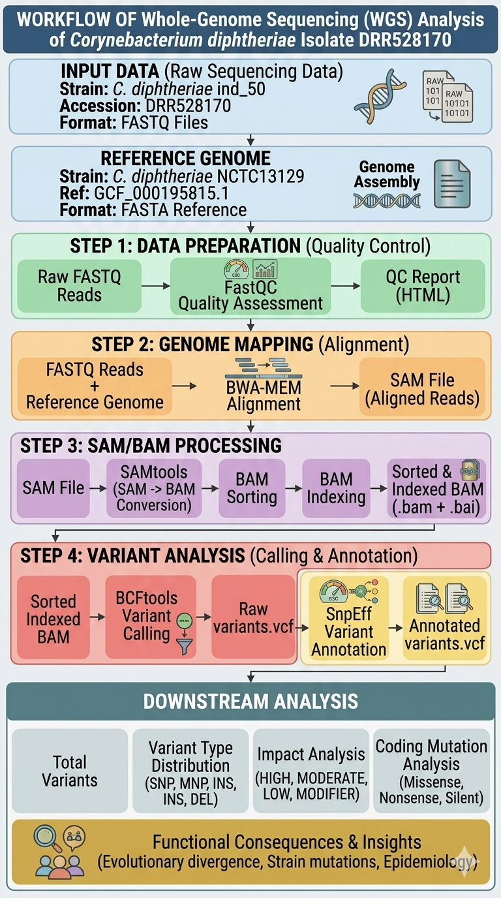

# Whole-Genome Sequencing Analysis of *Corynebacterium diphtheriae* Isolate DRR528170
 
### Genomic Characterization of an Indonesian Outbreak Strain: Vaccine Antigen Conservation and Emerging Resistance Markers
 
---
## Abstract
 
Diphtheria remains endemic in regions with suboptimal vaccination coverage, including Indonesia. This study presents a comprehensive whole genome sequencing (WGS) analysis of *Corynebacterium diphtheriae* isolate DRR528170 from Indonesia's 2012–2015 outbreak. High quality Illumina sequencing (300× depth, 92.33% mapping) identified 27,915 variants. Functional annotation revealed 188 HIGH-impact variants affecting 15 genes. Notably, major vaccine-target genes (*tox*, *dtxR*, pilus adhesins) exhibited complete structural conservation despite genome-wide divergence, suggesting maintained vaccine efficacy. A putative tetracycline resistance marker (*tipA* stop-lost) was identified. This analysis contributes to limited genomic surveillance data for Indonesian *C. diphtheriae* and provides baseline characterization for future outbreak investigations in Southeast Asia.
 
---
## Introduction
 
### Diphtheria as a Reemerging Threat
 
Despite being preventable through vaccination, diphtheria caused by toxigenic *Corynebacterium diphtheriae* remains endemic in regions with inadequate immunization coverage. Indonesia experienced substantial outbreaks in 2012–2015 during periods of vaccination coverage gaps. Limited genomic surveillance data restrict understanding of circulating strains and vaccine escape potential.

### Study Objectives
 
This study aims to characterize the genomic composition of *C. diphtheriae* isolate DRR528170 recovered during Indonesia's 2012–2015 diphtheria outbreak and assess how genomic variants diverge from and impact protein function relative to the NCTC13129 reference strain.

 ---
 
## Methods
 
**Complete methodological details are provided in [METHODS.md](./METHODS.md)**
 

 
The analysis was conducted across four sequential stages: (1) data preparation and quality control, (2) reference genome alignment, (3) SAM/BAM processing, and (4) variant calling and functional annotation.
 
---
 
## Results
 
**Comprehensive results are presented in [RESULTS.md](./RESULTS.md)**
 
### Sequencing and Alignment Quality

High-quality paired-end reads were generated and aligned to the reference genome with exceptional efficiency, exceeding standard WGS thresholds across all metrics.
 
| Parameter | Value | Threshold | Status |
|-----------|-------|-----------|--------|
| Total reads | 4,324,446 | ≥1,000,000 | ✅ |
| Read length (bp) | 150 | 100–300 | ✅ |
| GC content (%) | 53 | ~53 | ✅ |
| Mapping rate (%) | 92.33 | >85 | ✅ |
| Properly paired (%) | 91.44 | >85 | ✅ |
| Mean sequencing depth (×) | 360.53 | ≥30 | ✅ |
| Genome coverage breadth (%) | 95.32 | >90 | ✅ |
| Mean base quality (Phred) | 34 | ≥30 | ✅ |
| Mean mapping quality | 58.6 | ≥30 | ✅ |
 
### Variant Landscape
 
Variant calling identified 27,915 total variants, dominated by SNPs consistent with point mutation accumulation during endemic transmission.
 
| Variant Type | Count | Percentage |
|--------------|-------|------------|
| SNP | 23,070 | 82.63% |
| MNP | 4,170 | 14.93% |
| Insertion | 219 | 0.78% |
| Deletion | 211 | 0.76% |
| Complex | 245 | 0.88% |
| **Total** | **27,915** | **100%** |
 
### Functional Impact Classification
 
SnpEff v5.4 classified each variant by predicted functional consequence. The majority of variants (61.94%) are synonymous or non-coding, with only 0.67% predicted to be highly disruptive.
 
| Impact Level | Count | Percentage | Predicted Consequence |
|--------------|-------|------------|-----------------------|
| HIGH | 188 | 0.67% | Frameshift, stop codon gained/lost, start lost |
| MODERATE | 6,607 | 23.66% | Missense substitution, inframe indel |
| LOW | 17,291 | 61.94% | Synonymous variant, splice region |
| MODIFIER | 3,829 | 13.72% | Intergenic, upstream/downstream variant |
| **Total** | **27,915** | **100%** | — |
 
### Genes of Clinical Significance
 
Vaccine-relevant genes and antimicrobial resistance markers were evaluated for functional impact. Despite genome-wide divergence, no HIGH-impact variants were identified in any primary vaccine antigen gene. One resistance-associated gene carried a disruptive variant.
 
| Gene ID | Gene Symbol | Encoded Protein | Variant Effect | Function | Status |
|---------|-------------|----------------|----------------|----------|--------|
| — | *tox* | Diphtheria toxin | None (HIGH-impact) | Primary vaccine antigen | ✅ Conserved |
| — | *dtxR* | Diphtheria toxin repressor | None (HIGH-impact) | Regulates toxin expression | ✅ Conserved |
| — | *spaA* | Major pilus subunit | None (HIGH-impact) | Surface adhesin | ✅ Conserved |
| — | *spaB* | Minor pilus subunit | None (HIGH-impact) | Surface adhesin | ✅ Conserved |
| — | *spaC* | Pilus tip adhesin | None (HIGH-impact) | Host cell attachment | ✅ Conserved |
| DIP0102 | *tipA* | TipA efflux pump | Stop lost + splice region | Tetracycline resistance | ⚠️ Disrupted |
 
---

## Conclusion
 
Whole-genome sequencing of *C. diphtheriae* isolate DRR528170 identified 27,915 variants relative to reference strain NCTC13129, demonstrating substantial genomic divergence. However, sequencing revealed no HIGH-impact variants within primary vaccine antigen genes, particularly the diphtheria toxin gene (*tox*) and its regulator (*dtxR*), suggesting that vaccine-induced immunity should remain protective against this Indonesian strain. Notably, a disruptive variant was detected in *tipA*, encoding a tetracycline resistance efflux pump, reinforcing the need to incorporate antimicrobial resistance surveillance into routine genomic monitoring. These results expand the limited WGS data available for *C. diphtheriae* in Southeast Asia and support continued genomic surveillance to monitor pathogen evolution in endemic regions.
 
---
 
## References
 
1. Cerdeño-Tárraga, A. M., et al. (2003). The complete genome sequence and analysis of *Corynebacterium diphtheriae* NCTC13129. *Nucleic Acids Research*, 31(22), 6516–6523. https://doi.org/10.1093/nar/gkg874
2. Cingolani, P., et al. (2012). A program to annotate and predict the effects of DNA sequence variants. *Fly*, 6(2), 80–92. https://doi.org/10.4161/fly.19695
3. Garrison, E., & Marth, G. (2012). Haplotype-based variant detection from short-read sequencing. *arXiv*, 1207.3907. https://arxiv.org/abs/1207.3907
4. Li, H., & Durbin, R. (2009). Fast and accurate short read alignment with Burrows-Wheeler transform. *Bioinformatics*, 25(14), 1754–1760. https://doi.org/10.1093/bioinformatics/btp324
5. Zasada, A. A. (2013). Corynebacterium diphtheriae — current epidemiology, clinical manifestations, and molecular basis of virulence. *Journal of Clinical Microbiology*, 51(10), 3165–3173. https://doi.org/10.1128/JCM.00581-13
---
 
## Repository Structure
 
```
cdif-wgs-analysis/
├── README_v2.md           # Project overview (this file)
├── METHODS.md             # Complete analytical pipeline
├── RESULTS.md             # Detailed results with all tables
├── DISCUSSION.md          # Biological interpretation and references
├── figures/
│   ├── workflow_diagram.png
│   ├── variant_distribution_pie.png
│   └── impact_level_pyramid.png
├── scripts/
│   ├── 01_qc.sh
│   ├── 02_align.sh
│   ├── 03_variant_calling.sh
│   └── 04_annotation.sh
└── data/
    └── README.md          # Data sourcing and access instructions
```
 
## Reproducibility
 
```bash
# Download raw reads
prefetch DRR528170
fastq-dump --split-files DRR528170/DRR528170.sra
 
# Download reference genome
wget https://ftp.ncbi.nlm.nih.gov/genomes/all/GCF/000/195/815/GCF_000195815.1_ASM19581v1/GCF_000195815.1_ASM19581v1_genomic.fna.gz
```

## Data Availability
 
- **Raw reads:** [NCBI SRA BioProject PRJDB12216](https://www.ncbi.nlm.nih.gov/bioproject/PRJDB12216)
- **Isolate:** DRR528170
- **Reference:** *C. diphtheriae* NCTC13129 (GCF_000195815.1)

All data publicly accessible. Analysis fully reproducible from open-source tools.

---

## Author
 
**Mutiara Annisa Masruroh**  
[LinkedIn](https://linkedin.com/in/mutiara-am)
[E-mail](mutiaraam@gmail.com)

---
 | **Last Updated:** June 2026
